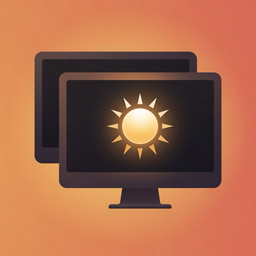

# Candela

菜单栏里调节每一块显示器的亮度、音量和排列。

English: [README.en.md](README.en.md)

[下载最新版本](https://github.com/WymanY/Candela/releases/latest)

需要 macOS 14 或更新。目前提供 Apple Silicon（arm64）DMG，已用 Developer ID 签名并完成公证。

<p align="center">
  
</p>

## 能做什么

- 调节苹果屏背光和第三方显示器亮度；硬件调光不可用时改用 Software dimming / 软件调光。
- 显示器带 HDMI / DisplayPort 音箱时，直接调音量和静音。
- 一键套用 Night / 夜间、Desk / 桌面、Max / 最大。
- 打开 Follow keyboard brightness / 跟随键盘亮度后，键盘亮度键调节内建屏时，其他屏按相对偏移一起变化。
- 用 Scenes / 场景记住当前各屏状态，之后 Save Scene / 保存场景、Apply Scene / 应用场景。
- 用 Mirror / 镜像把外接屏叠到内置屏；用 Layout / 布局打开 Display Layout / 显示器排列，拖动 Arrange extended displays / 排列扩展显示器。
- 每块真实屏可以打开 Picture in Picture / PiP；底部 Overview / 多屏 打开 Display Overview / 多屏预览。
- 笔记本没插电时，面板标题旁显示电池电量和剩余时间。

## 安装

从 [最新 GitHub Release](https://github.com/WymanY/Candela/releases/latest) 下载 Apple Silicon 的 `Candela-*-arm64.dmg`，把 `Candela.app` 拖进「应用程序」。

这份直装包已用 Developer ID 签名，并经过 Apple 公证。

## 明确不做的事

Candela 不会创建虚拟屏、改写 EDID、解锁 XDR 亮度、强制 HiDPI 或自定义分辨率，也不会接管媒体键。平时不会改系统默认音频输出；只有 Apply Scene / 应用场景 时，才会切回该场景记住的扬声器。

GitHub 上的直装包是 Developer ID 构建，不是 Mac App Store 上架包。App Store 列表也还没有发布。

## 系统要求

- macOS 14.0 Sonoma 或更新
- 必须原生运行，拒绝 Rosetta
- 第三方显示器的 DDC 亮度 / 音量目前做在 Apple Silicon 上
- Picture in Picture / PiP 和 Display Overview / 多屏预览需要屏幕录制权限

## 开发

仓库已经提交 `Candela.xcodeproj`：

```sh
git clone https://github.com/WymanY/Candela.git
cd Candela
open Candela.xcodeproj
```

更完整的说明：

- 使用帮助：[docs/using.md](docs/using.md) · [English](docs/using.en.md)
- 本地开发：[docs/developing.md](docs/developing.md) · [English](docs/developing.en.md)
- 打 tag 发布：[docs/releasing.md](docs/releasing.md) · [English](docs/releasing.en.md)

## 命令行 / Agent

先让 Candela 保持运行。CLI 通过 `~/Library/Application Support/Candela/control.sock` 和控制面通信。

```sh
swift run --package-path . candela-cli list
swift run --package-path . candela-cli set-brightness --display builtin --value 0.35
swift run --package-path . candela-cli preset night
```

其余命令、本地 `candela-mcp` 和 Codex skill 见 [docs/developing.md](docs/developing.md) 与 [`skills/candela`](skills/candela)。

## 许可证

MIT。见 [LICENSE](LICENSE) 和 [NOTICE](NOTICE)。
