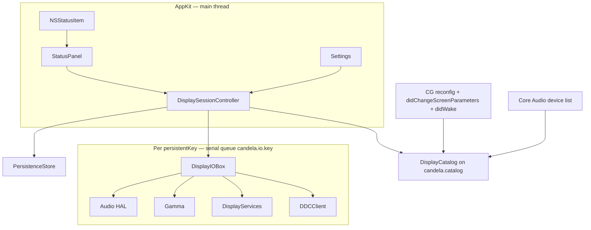
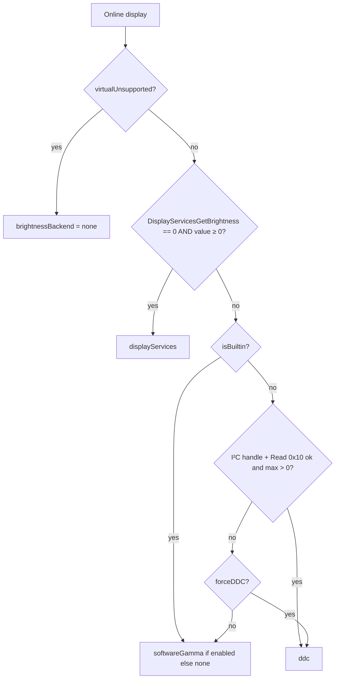

# Candela — Technical Design Document

| Field | Value |
| --- | --- |
| **Title** | Candela: Menu-bar brightness and per-display volume for macOS |
| **Author** | Candela maintainers |
| **Date** | 2026-08-13 |
| **Revised** | 2026-08-13 (review pass 3) |
| **Status** | Draft |
| **Product name** | **Candela** (do not ship as “BetterDisplay”) |
| **Bundle ID** | `app.candela.macos` |
| **Workspace** | `/Users/wyman/Documents/betterDisplay` (folder name may stay; product name must not) |
| **Repo state** | Greenfield. Empty directory. No Xcode project, packages, or source. |
| **Language** | Swift 5.10 language mode (tools-version 6.0). Not Swift 6 strict concurrency. |
| **Audience** | Senior macOS engineers implementing this repo from the document alone |

> 一句话：**菜单栏控制所有显示器亮度；外接屏若带 HDMI/DP 音箱，同时调节该屏音量。**

This document is the implementation contract. Byte layouts, identity keys, matchers, and state machines below are normative. Prior-art projects are cited only as history; **do not vendor them and do not treat their source as the spec.**

---

## Overview

macOS only exposes a real brightness control for Apple-owned panels (MacBook/iMac built-in, Studio Display, Pro Display XDR, and a few Apple-partner LG UltraFine models). For every other HDMI / DisplayPort / USB-C monitor the system brightness slider is missing or inert, and HDMI/DP speaker volume is either a digital passthrough (no HAL slider) or a separate Core Audio device that System Settings will not associate with the picture.

**Candela** is a native **AppKit** menu-bar extra that:

1. Discovers every connected display and stays live across cable/dock hot-plug.
2. Drives **hardware** brightness when a path exists (DisplayServices for Apple panels; DDC/CI VCP `0x10` for third-party).
3. Falls back to **software gamma dimming** when hardware control is absent or fails at probe or at runtime.
4. Drives **per-display volume/mute** when the monitor exposes speakers (Core Audio HAL first — including Apple Studio / XDR / UltraFine — DDC VCP `0x62` / `0x8D` second).
5. Persists last brightness and last volume against a **versioned `persistentKey`**, never against `CGDirectDisplayID`.

v1 is a thin slice: discover, dim, volume, persist, launch-at-login. Virtual screens, EDID override, HiDPI, XDR unlock, PiP, and color-profile management are non-goals.

The next implementation step is **PR 1** (scaffold) in [PR Plan](#pr-plan).

---

## Background & Motivation

### Current state

The workspace is empty. There is no existing architecture to extend.

### Pain points

| Pain | Why it exists |
| --- | --- |
| External monitor brightness is not in System Settings | Quartz does not expose backlight for third-party panels. `NSScreen` has no brightness API. |
| Keyboard brightness keys ignore the external | They only talk to DisplayServices / the built-in backlight. |
| HDMI/DP speakers often have no volume slider | Many digital outputs report no HAL volume. Volume lives in the monitor (DDC) or is locked at 100 %. |
| `CGDirectDisplayID` is session-unstable | Reconnect, sleep, clamshell, and GPU switch reassign IDs. |
| DDC is slow and flaky | 50–200 ms per I²C transaction; USB HDMI dongles and some MST hubs drop AUX. |
| Software dimming reverts | WindowServer resets LUTs unless the app keeps them alive. |

### Prior art (non-normative)

| Project | License | Use |
| --- | --- | --- |
| MonitorControl | MIT | Historical confirmation that these private symbols exist. **Not the spec.** |
| AppleSiliconDDC | MIT | Historical `IOAVService` usage. **Not the spec.** |
| ddcctl | MIT | Historical Intel I²C. **Not the spec.** |
| VESA E-DDC / MCCS | Public | VCP codes. Packet bytes in this document are normative. |
| BetterDisplay | Proprietary | UX reference only. Do not copy source, assets, or trademark. |

We write our own protocol-first Swift packages. Cite MIT projects in `NOTICE` only if a snippet is adapted. **Do not fork MonitorControl** (license would allow it; the architecture is a God-object Display class, not what we want). Do not add it as a dependency.

---

## Goals & Non-Goals

### Goals (v1)

1. Live catalog of physical displays (built-in + external) as cables and docks attach/detach.
2. Hardware brightness for Apple panels via DisplayServices.
3. Hardware brightness for third-party panels via DDC/CI VCP `0x10` (Apple Silicon `IOAVService` and Intel `IOI2CInterface`).
4. Software brightness via **gamma tables** when hardware is unavailable, including a keep-alive so WindowServer does not revert the LUT.
5. Per-display volume + mute when the display has speakers (Core Audio HAL and/or DDC `0x62`/`0x8D`), including Apple external panel speakers.
6. Menu-bar extra as the only everyday surface; per-display sliders; no bulky main window.
7. Persist last brightness, last volume, mute, and per-display identity in standard `UserDefaults`.
8. Launch at login via `SMAppService`.
9. String Catalog checked in from PR 1 with English development strings; **Simplified Chinese translations land in the localization PR** before public v1.
10. Developer ID + notarized distribution. Universal binary (arm64 + x86_64). `LSRequiresNativeExecution = true`.
11. Protocol-first backends so CI can run with fakes and no hardware.

### Non-goals (v1)

- Virtual screens / dummy displays / EDID override / custom resolutions / HiDPI forcing
- XDR / HDR extra-brightness unlock, brightness beyond 100 %
- Picture-in-Picture, teleprompter, soft-disconnect
- Color profile / RGB vs YCbCr switching
- Combined hardware+software slider (0–50 % SW / 50–100 % HW)
- Contrast (VCP `0x12`), input select (`0x60`), color temperature, geometry, other VCP playgrounds
- Sidecar / AirPlay / Continuity / DisplayLink **control** (detect and mark unsupported)
- Native macOS OSD hijack (`OSDManager`)
- Media-key / brightness-key takeover; no “coming later” UI teaser
- App Intents / Shortcuts / Sparkle / iCloud
- Mac App Store build / privileged helper / System Extension / DriverKit
- Changing the system default audio output (“Set as system output”)
- Windows / Linux
- In-app crash reporter

### v1 “detect but do not control”

| Display class | Shown? | Controls |
| --- | --- | --- |
| Built-in Apple panel | Yes | Hardware brightness. **No volume row.** |
| Apple Studio / XDR / partner UltraFine | Yes | DisplayServices brightness **and HAL volume** (USB/TB speakers) |
| Third-party DP / USB-C / HDMI with DDC | Yes | DDC brightness ± volume (HAL if HDMI/DP/TB device matches) |
| Third-party without DDC | Yes | Software gamma; volume only if a non-USB HAL device matches |
| Sidecar, AirPlay, Continuity, DisplayLink, dummy `0xF0F0` | Yes, greyed | None |
| Mirrored slave (`CGDisplayMirrorsDisplay(id) != 0`) | Hidden | Control the master only |

---

## Key Decisions

| # | Decision | Rationale |
| --- | --- | --- |
| K1 | **Product name: Candela.** Bundle `app.candela.macos`. | Not the BetterDisplay trademark. |
| K2 | **LSUIElement accessory app.** Settings temporarily promotes to `.regular`. | Everyday surface is the menu-bar extra. |
| K3 | **Single process. No XPC, no privileged helper.** | I²C works from a non-sandboxed user app. |
| K4 | **Non-sandboxed, Hardened Runtime, Developer ID + notarization.** Not MAS. | Sandbox blocks I²C. MAS rejects private DisplayServices / IOAVService. |
| K5 | **Minimum macOS 14.0.** Universal arm64 + x86_64. | `SMAppService`, String Catalogs, smaller test matrix. Users in 2026 are on macOS 14, 15, and macOS 26. |
| K6 | **AppKit-only UI.** | User constraint. |
| K7 | **Custom `NSPanel` under the status item.** | `NSMenu` sliders dismiss unpredictably. |
| K8 | **Exclusive brightness backend: DisplayServices → DDC → gamma.** Live failure uses the hysteresis machine in §8, not a mixed slider. | Testable. Mixed 0–50/50–100 is a BetterDisplay-ism. |
| K9 | **Software dimming = `CGSetDisplayTransferByTable` plus a 2 s keep-alive timer** while `t < 1`. No overlay in v1. | WindowServer reverts idle LUTs. Timer avoids a shielding window. |
| K10 | **Volume: HAL first (`AudioObject*` only), DDC `0x62` second.** Never change default output. Auto-bind HDMI/DP/TB only; USB auto-bind **only** for the Apple-external allowlist. | USB headsets must not attach to a USB-C display row. AHS functions are dead as of 10.11. |
| K11 | **Keyboard / media-key takeover is out of v1.** No footnote advertising it. | TCC cost. |
| K12 | **Private I/O lives in SPM target `CandelaPrivateIO` (C + module map).** Swift calls **only** through `dlsym` function pointers. App bridging header is empty. | SPM libraries cannot see an app bridging header. `extern` without `dlsym` fails to link or aborts if a symbol vanishes. |
| K13 | **Local SPM packages + thin Xcode app + XcodeGen `project.yml`.** Not a MonitorControl fork. | Protocol-first, unit-testable. |
| K14 | **Contrast and other VCPs out of v1.** Force DDC is write `0x10` only (plus volume VCPs on the same client). | Prevents a VCP playground. |
| K15 | **Identity equality and UserDefaults key = `persistentKey` only**, prefixed `v1:`. Twins disambiguated by **`v1:core-port-<fnv(port)>`**, not walk index and **not** “any record on this port.” Cold start resolves `[suffixed, unsuffixed]` + aliases only. | A dock port is not a monitor. Port-only lookup would give a Dell’s key to an LG on the same USB-C. |
| K16 | **One `DDCClient` per `persistentKey`, one serial GCD queue, all VCP codes, one shared `lastDDC` / `ddcInFlight`.** | Concurrent or back-to-back `0x10` and `0x62` on one AUX corrupts checksums. HAL/DS/gamma must not stamp `lastDDC`. |
| K17 | **No service actors.** `@MainActor DisplaySessionController` + per-identity serial queues. Mailbox `setBrightness` / `setVolume` (not `async throws` per slider tick). | A single actor would serialize display A with display B. |
| K18 | **Swift 5.10 language mode** (tools 6.0). `SWIFT_STRICT_CONCURRENCY = targeted` on the app; `minimal` on C-adjacent kits. | Swift 6 strict + IOKit/`dlsym` forces dishonest `@unchecked Sendable`. |
| K19 | **`LSRequiresNativeExecution = true`.** Runtime abort if `sysctl.proc_translated == 1`. | Rosetta on Apple Silicon would take the Intel I²C path, which does not talk to DCP. |
| K20 | **HAL via `AudioObjectHasProperty` / `Get` / `SetPropertyData` only.** Volume: optional `'vmvc'` if HasProperty, then `VolumeScalar` Main, then every settable output element from `StreamConfiguration`. Mute: `kAudioDevicePropertyMute` Main, then every settable element. No AHS functions. No VirtualMasterMute. | `'vmm '` does not exist. AHS is deprecated and uses a different object ID space. |
| K21 | **Reconnect restore: ours wins.** If `restoreOnReconnect` and a last value exists, we write it even if the OSD changed while unplugged. | That is the point of persistence. User can disable the flag. |
| K22 | **Force DDC never overrides a successful DisplayServices probe.** After a DS probe win, live failure may go to **gamma or none only** — never DDC — until a *new* `probeBrightness` (not a live fail, not `recreateHandles` alone) chooses otherwise. | Protects Studio / UltraFine from a transient DS glitch. |
| K23 | **Recreate I²C handles on every catalog rescan and on `didWake`.** | Stale `IOAVService` after sleep is a common hard fail. |
| K24 | **Gamma keep-alive = repeating 2 s timer**, not an enforcer window. Recapture baseline after every reconfig before applying `t`. | Mode changes replace the ColorSync table. |
| K25 | **Compile flag `CANDELA_GAMMA_ONLY`** strips DDC and DisplayServices call sites. | Rollback if notary policy tightens. |
| K26 | **UserDefaults = standard suite for `app.candela.macos`.** Do not create a second named suite. | A named suite with the same ID is the same plist; a different name would split settings. |

---

## Proposed Design

### 1. Product and process model

```
Candela.app  (LSUIElement=true, LSRequiresNativeExecution=true, activationPolicy=.accessory)

Main thread
  @main AppDelegate
  StatusItemController → StatusPanel (NSPanel)
  SettingsWindowController (promotion to .regular)
  DisplaySessionController (@MainActor)

Background (plain classes + GCD, not actors)
  DisplayCatalog          — serial queue candela.catalog
  DisplayIORouter         — one DisplayIOBox per persistentKey
      DisplayIOBox.queue  — candela.io.<persistentKey>
          DDCClient (all VCP)
          DisplayServicesBackend
          GammaBackend
          AudioHALBackend
  PersistenceStore        — called from main; UserDefaults
```

- One user process. No XPC, no launch daemon, no System Extension.
- `NSApplication.ActivationPolicy.accessory` at launch.
- Opening Settings: `setActivationPolicy(.regular)`. Closing Settings: return to `.accessory` if the panel is not key.
- Quit: stop gamma timer, restore baseline LUTs, then `NSApp.terminate`.
- `NSSupportsAutomaticTermination = false`, `NSSupportsSuddenTermination = false`.
- No crash reporter in v1.

Rosetta guard in `applicationWillFinishLaunching`:

```swift
var translated: Int32 = 0
var size = MemoryLayout<Int32>.size
if sysctlbyname("sysctl.proc_translated", &translated, &size, nil, 0) == 0, translated == 1 {
    // Log and terminate. Native slice must run.
    NSApp.terminate(nil)
}
```

### 2. Module / package layout

```
betterDisplay/
├── project.yml
├── Candela.xcodeproj          # generated by XcodeGen; committed
├── Package.swift
├── .gitignore
├── .github/workflows/ci.yml
├── NOTICE
├── LICENSE
├── App/Candela/
│   ├── Sources/
│   │   ├── AppDelegate.swift          # @main, only entry
│   │   ├── StatusItemController.swift
│   │   ├── StatusPanelController.swift
│   │   ├── StatusPanelView.swift
│   │   ├── DisplayRowView.swift
│   │   ├── SettingsWindowController.swift
│   │   ├── SettingsGeneralView.swift
│   │   ├── SettingsDisplaysView.swift
│   │   ├── SettingsAboutView.swift
│   │   ├── DisplaySessionController.swift
│   │   └── NSScreen+Candela.swift     # AppKit-only helper
│   ├── Resources/
│   │   ├── Assets.xcassets
│   │   ├── Localizable.xcstrings
│   │   └── Info.plist
│   └── Supporting/
│       └── Candela.entitlements
├── Sources/
│   ├── CandelaPrivateIO/              # C target: headers + module map only
│   │   ├── include/CandelaPrivateIO.h
│   │   └── include/module.modulemap
│   ├── DisplayCore/                   # CG + models; no AppKit; no DDC
│   ├── BrightnessKit/
│   ├── AudioKit/
│   ├── PersistenceKit/
│   └── TestSupport/
├── Tests/
│   ├── DisplayCoreTests/
│   ├── BrightnessKitTests/
│   ├── AudioKitTests/
│   └── PersistenceKitTests/
└── Scripts/
    ├── generate_project.sh
    └── notarize.sh                    # packaging PR
```

**Dependency direction (no cycles):**

```
CandelaPrivateIO          (C, no deps)
        ↑
DisplayCore               (Foundation + CoreGraphics only)
        ↑
PersistenceKit
        ↑
BrightnessKit  ← uses DisplayCore.DDCCommanding; links CandelaPrivateIO
AudioKit       ← uses DisplayCore.DDCCommanding; no I²C of its own
        ↑
TestSupport    ← DisplayCore only (not PersistenceKit)
        ↑
App/Candela
```

`DisplayCore` has **zero AppKit**. `NSScreen` mapping lives in `App/Candela/Sources/NSScreen+Candela.swift`.

Catalog IOKit walks that need IOReg may live in BrightnessKit (`IOKitDisplaySource`) and feed `DisplayCore` structs. DisplayCore itself only consumes already-fetched dictionaries / CG IDs.

### 3. Runtime architecture



**Hot-plug sequence (normative):**

```mermaid
sequenceDiagram
    participant OS as WindowServer / HAL
    participant Cat as DisplayCatalog
    participant DSC as DisplaySessionController
    participant Box as DisplayIOBox
    participant UI as StatusPanel

    OS->>Cat: reconfig / devices / wake
    Cat->>Cat: debounce 400 ms
    Cat->>Cat: CGGetOnlineDisplayList + IOKit dictionaries
    Cat->>DSC: AsyncStream on main
    DSC->>Box: recreateHandles()
    DSC->>Box: probeBrightness()
    DSC->>DSC: AudioMatching.match(display, devices)
    DSC->>Box: bindAudio(uid) then probeDDCVolume() if needed
    Box-->>DSC: BrightnessCapabilities + VolumeCapabilities
    DSC->>DSC: merge into DisplaySnapshot; restore machine
    DSC->>UI: apply snapshots
```

Brightness probe and volume probe on the same `DisplayIOBox` **never run concurrently**. Catalog calls them sequentially (brightness first).

### 4. Threading and mailbox (single model)

**There are no service actors.** Isolation is:

| Object | Isolation |
| --- | --- |
| `AppDelegate`, views, `DisplaySessionController` | `@MainActor` |
| `DisplayCatalog` | serial queue `candela.catalog`; publishes via `AsyncStream` that yields on main |
| One `DisplayIOBox` per `persistentKey` | serial queue `candela.io.<persistentKey>` |
| Persistence | main |

Queue names use **`persistentKey`**, never `CGDirectDisplayID`. Rebind after unplug reuses the box if the key is the same; the box’s `sessionDisplayID` field is updated under the same queue.

#### Mailbox API (normative)

```swift
// DisplayIOBox — all methods except init hop to `queue` internally.
func setBrightness(_ value: Double)          // mailbox; returns immediately
func setVolume(_ value: Double)
func setMuted(_ muted: Bool)
func currentBrightness() async -> Double
func currentVolume() async -> Double
func isMuted() async -> Bool
func probeBrightness(kind: DisplayKind) async -> BrightnessCapabilities
func bindAudio(uid: String?)                 // result of AudioMatching.match (DSC)
func probeDDCVolume() async -> VolumeCapabilities
func recreateHandles() async
func restoreSoftwareOnQuit() async
```

`setBrightness` / `setVolume` are **not** `async throws`. Slider ticks must not create a `Task` per event.

Matching is **not** inside the box. `DisplaySessionController` runs the pure function `AudioMatching.match(...)` (§9.3) on the catalog snapshot + HAL device list, then calls `bindAudio(uid:)`. The box only talks HAL to that UID and DDC volume through `DDCCommanding` on `candela.io.<key>`.

#### Coalesce state machine (normative — consume `latest`)

One worker per `DisplayIOBox`. Two **value** mailboxes, **one** DDC bus gate:

```
brightness.latest: Double?     // nil = nothing pending
volume.latest: Double?
mute.latest: Bool?

ddcInFlight: Bool              // true only while a VCP pulse is running
lastDDC: ContinuousClock.Instant?   // stamped only after a finished I²C pulse
                                           // NEVER stamped by HAL, DisplayServices, or gamma

sliderHold: 80 ms              // after last set* while no write scheduled
ddcWriteSpacing: 80 ms         // floor between any two I²C pulses on this box
```

`brightness.latest` and `volume.latest` are independent values. They **share** `ddcInFlight` and `lastDDC`. A brightness SET and a volume SET on DDC may not run 0 ms apart.

**`beginWrite` consume (required — this is what prevents an infinite loop):**

```
beginWrite(channel):                // channel is brightness or volume
  toSend = channel.latest
  channel.latest = nil              // CONSUME. Do not leave toSend in latest.
  if toSend == nil: return          // nothing to do
  if channel uses DDC:
      ddcInFlight = true
      perform DDC pulse(toSend)     // 2 identical SETs, 10 ms apart, 1 retry of the pulse
      lastDDC = now                 // only path that stamps lastDDC
      ddcInFlight = false
      feed live-failure machine (§8) if channel == brightness
  else:
      // DisplayServices / gamma / HAL — spacing 0, do not touch lastDDC or ddcInFlight
      perform backend write(toSend)
  scheduleNext()
```

**`scheduleNext`:**

```
if ddcInFlight: return              // completion will call scheduleNext
if brightness.latest == nil && volume.latest == nil && mute.latest == nil:
    state = idle; return

pick = first pending in order: brightness, then volume, then mute

if pick uses DDC:
    wait = lastDDC.map { ddcWriteSpacing - (now - $0) } ?? 0
    if wait > 0: arm waitSpacing(wait), then beginWrite(pick)
    else: beginWrite(pick)
else:
    beginWrite(pick)                // HAL / DS / gamma: no DDC floor
```

Events:

| Event | Action |
| --- | --- |
| `setBrightness(v)` | `brightness.latest = v` (replace, do not queue a history). UI already shows `v`. Arm `sliderHold` if no write is scheduled. |
| `setVolume(v)` / `setMuted(m)` | Same for that mailbox. |
| `sliderHold` fires | `scheduleNext()` |
| `waitSpacing` fires | `beginWrite(pick)` for the channel that was waiting. Re-read `latest` at fire time (a newer set* may have replaced it). **Consume** in `beginWrite`. |
| write completes | `scheduleNext()`. If a *new* `latest` arrived during `inFlight` (`latest != nil` after consume), that is the only reason another pulse runs. |

**One `setBrightness(0.5)` after idle ⇒ exactly one pulse** (plus the specified 2-cycle copy inside that pulse), then `latest == nil` and `idle`. Required unit test in PR 4a: fake `DDCCommanding` records write count; one set after idle → `writeCount == 2` (the two-cycle pulse) or `== 1` if the fake collapses cycles; **never** grows without a further `set*`.

HAL-only volume uses the volume mailbox with `spacing = 0` and **must not** stamp `lastDDC`. A HAL volume write must not delay a pending DDC brightness pulse (after the serial queue finishes the HAL call, `scheduleNext` sees `wait == 0` for DDC if `lastDDC` is old or nil). DisplayServices and gamma brightness are the same: they do not stamp `lastDDC`.

**Write pulse (DDC only):** two identical SET packets, **10 ms** `usleep` between them (`ddcWriteCycles = 2`). That 10 ms is **inside** `beginWrite` and does **not** use `ddcWriteSpacing`. Probe reads: 3 tries, 20 ms between tries; probe is also `ddcInFlight` and stamps `lastDDC` when it finishes so a slider cannot collide with probe.

Constants (code only; **not** in Settings UI):

| Constant | Default |
| --- | --- |
| `ddcWriteSpacing` | 80 ms |
| `sliderHold` | 80 ms |
| `ddcReadGap` | 50 ms after Arm64 write before read |
| `ddcRetryCount` live | 1 extra pulse |
| `ddcRetryCount` probe | 3 |
| `ddcWriteCycles` | 2 (10 ms apart, inside the pulse) |
| `hotPlugDebounce` | 400 ms |
| `restoreDelayAfterAttach` | 700 ms |
| `gammaKeepAlive` | 2 s |
| `liveFailThreshold` | 3 consecutive write failures |

### 5. Display identity (pure function)

`CGDirectDisplayID` is a session handle only. It is never a dictionary key and never part of `==` / `hash`.

#### Inputs

```swift
public struct DisplayIdentityInputs: Equatable, Sendable {
    public var vendorID: UInt32            // 0 if CG returns 0xFFFFFFFF
    public var productID: UInt32           // 0 if CG returns 0xFFFFFFFF
    public var serial: UInt32              // 0 if CG returns 0
    public var alphanumericSerial: String? // see key sources
    public var edidUUID: String?           // hyphenated uppercase, or nil
    public var portLocation: String        // kIODisplayLocationKey, else "unit:<n>"
    public var unitNumber: UInt32          // CGDisplayUnitNumber
    public var fallbackName: String        // product name, already chosen
}

public struct DisplayIdentityFields: Equatable, Sendable {
    public var inputs: DisplayIdentityInputs
}

public struct DisplayIdentity: Codable, Sendable {
    public var persistentKey: String       // only this participates in Hashable/Equatable
    public var fields: DisplayIdentityFields
}

extension DisplayIdentity: Hashable, Equatable {
    public static func == (l: Self, r: Self) -> Bool { l.persistentKey == r.persistentKey }
    public func hash(into hasher: inout Hasher) { hasher.combine(persistentKey) }
}
```

#### Key sources (both architectures)

| Field | Apple Silicon | Intel |
| --- | --- | --- |
| vendor / product / serial | `CGDisplayVendorNumber` / `ModelNumber` / `SerialNumber`; treat `0xFFFFFFFF` vendor/product as 0 | Same |
| alphanumericSerial | IOReg framebuffer `DisplayAttributes.ProductAttributes.AlphanumericSerialNumber`, else EDID descriptor `0xFF`, else `kDisplaySerialString` | `IODisplayCreateInfoDictionary`: `kDisplaySerialString`, else EDID `0xFF` |
| edidUUID | IOReg property `"EDID UUID"` (keep hyphens, uppercase) | Synthesize from `kIODisplayEDIDKey` CFData (see below) |
| portLocation | `kIODisplayLocationKey` from `CoreDisplay_DisplayCreateInfoDictionary` or IOReg path | `kIODisplayLocationKey` from `IODisplayCreateInfoDictionary` |
| unitNumber | `CGDisplayUnitNumber` | Same; also parsed from last `@N` in `kIODisplayLocationKey` if CG is 0 |
| fallbackName | CoreDisplay `DisplayProductName["en_US"]` else first value; **not** `NSScreen` inside DisplayCore | `IODisplayCreateInfoDictionary` `kDisplayProductName` first localized value |

IOKit matching port: **`kIOMainPortDefault`** (not deprecated `kIOMasterPortDefault`).

`CoreDisplay_DisplayCreateInfoDictionary` and `IODisplayCreateInfoDictionary` are **Create-rule**. Call sites: `takeRetainedValue()`.

#### Synthesize EDID UUID on Intel (and as ARM fallback)

If `"EDID UUID"` is missing and `kIODisplayEDIDKey` is at least 128 bytes:

```
bytes:
  mfg = EDID[8..9]           // big-endian manufacturer
  product = EDID[10] | (EDID[11] << 8)   // little-endian
  serial = EDID[12..15] LE
  week = EDID[16]
  year = EDID[17]            // raw, already year-1990
  hcm = EDID[21]             // horizontal cm
  vcm = EDID[22]
edidUUID string (hyphenated, uppercase hex):
  "%04X%02X%02X-%02X%02X-0000-%02X%02X-%02X%02X00000000"
  vendorHex, productLo, productHi, 0, 0, week, year, hcm, vcm
```

This is only used as an identity input, not as a DDC match key. DDC Arm64 matching uses the **IOReg** `"EDID UUID"` string as stored.

EDID ASCII serial (tag `0xFF`) / name (`0xFC`): scan four 18-byte descriptors at offsets 54, 72, 90, 108; if byte0-2 are `00 00 00` and byte3 is the tag, take bytes 5..17, trim `0x0A` and spaces.

#### `sanitizeToken` / `sanitizeName` (defined)

```
sanitizeToken(s):
  Unicode scalars keep if [A-Za-z0-9_-]
  drop everything else (including spaces)
  truncate to 64 characters
  empty → treat as missing

sanitizeName(s):
  fold to lowercase
  apply sanitizeToken
```

#### `persistentKey` algorithm (normative)

```
makeCore(inputs) -> String:
  if inputs.serial != 0:
      return sprintf("v%04X-p%04X-s%08X", vendor, product, serial)
  if let a = sanitizeToken(alphanumericSerial), !a.isEmpty:
      return sprintf("v%04X-p%04X-a-%s", vendor, product, a)
  if let u = edidUUID, !u.isEmpty:
      return "edid-" + u.uppercased()
  return sprintf("v%04X-p%04X-n-%s", vendor, product, sanitizeName(fallbackName))

fnv1a32(bytes) -> UInt32:          // FNV-1a 32-bit, normative constants
  h: UInt32 = 2166136261           // offset basis 0x811C9DC5
  for b in bytes:                  // UTF-8 of portLocation
      h = h ^ UInt32(b)
      h = h &* 16777619            // prime 0x01000193, 32-bit wrap
  return h

fnv1a32Hex(s) -> String:
  return String(format: "%08x", fnv1a32(Array(s.utf8)))   // 8 lowercase hex digits

makePersistentKey(inputs, siblings, records: [DisplayRecord]) -> String
  core = makeCore(inputs)
  hex = fnv1a32Hex(inputs.portLocation)
  suffixed = "v1:" + core + "-port-" + hex
  unsuffixed = "v1:" + core
  twins = siblings.filter { makeCore($0) == core && $0.serial == 0 && alphanumericMissing($0) }
  recordAtSuffix = records[suffixed] ?? records[resolveAlias(suffixed)]

  // 1. Two+ serial-less twins currently connected → always suffix.
  if twins.count >= 2:
      return suffixed

  // 2. Cold start / single remaining twin of the SAME core on this port.
  //    recordAtSuffix is v1:<this core>-port-<fnv(this port)> only.
  //    Never look up "any record whose portLocation matches" — that port
  //    is a dock/GPU jack; an LG must not inherit a Dell's key.
  if recordAtSuffix != nil:
      return suffixed

  // 3. Otherwise unsuffixed.
  return unsuffixed
```

**Cold-start record resolve** (before treating the display as unknown):

```
resolveRecord(inputs, records, aliases):
  core = makeCore(inputs)
  suffixed   = "v1:" + core + "-port-" + fnv1a32Hex(inputs.portLocation)
  unsuffixed = "v1:" + core
  for candidate in [suffixed, unsuffixed]:
      if let r = records[resolveAlias(candidate)]: return r
  return nil
  // NEVER: records.first { $0.portLocation == inputs.portLocation }
```

**When is `-port-` appended?** When `twins.count >= 2` now, **or** a record already exists at **`v1:<this core>-port-<fnv(this port)>`**. After one twin is unplugged, the survivor keeps that suffixed key because `recordAtSuffix` still hits (same core + same port FNV). A later single attach of a *different* panel on that jack computes a different `core` → different `suffixed` → miss → unsuffixed `v1:core` for the new panel. A serial-less monitor that has never been seen uses unsuffixed `v1:core`.

`DisplayRecord.portLocation` / `portSuffix` remain diagnostic (debug dump). They are **not** a resolve key.

**Key version:** every key starts with `v1:`. A future algorithm uses `v2:` and a migrator. Unprefixed keys are ignored.

#### Aliasing when the live key changes

Catalog, after computing `newKey = makePersistentKey(...)` for a still-connected box whose `oldKey` is known:

1. If `oldKey == newKey`: nothing.
2. If `oldKey != newKey` and a `DisplayRecord` exists at `oldKey`:
   - Copy the record to `newKey` (do not overwrite a newer `newKey` record).
   - Write `aliases[oldKey] = newKey` (one hop).
3. The live snapshot uses `newKey` only.

This runs for **all** of:

| Cause | Example |
| --- | --- |
| Stronger id appears | serial 0 → non-zero; EDID UUID arrives → `makeCore` changes |
| Twin appears | one serial-less Dell was `v1:core`; second Dell plugs in → live key becomes `v1:core-port-<fnv>` |
| Twin set collapses after a *new* probe with a stronger id | not a port-only keep |

Do **not** keep the old key as the live id when `makeCore` changed (that is the serial-appeared case). Alias forward.

`fallbackName` is **not** part of `Hashable`. A localized name change does not create a new display.

`fallbackName` is **not** part of `Hashable`. A localized name change does not create a new display.

#### Two identical monitors — Intel framebuffer bind

When resolving `IOFRAMEBUFFER_CONFORMSTO` to a `CGDirectDisplayID`, match **all** of:

- `kDisplayVendorID` == `CGDisplayVendorNumber`
- `kDisplayProductID` == `CGDisplayModelNumber`
- `kDisplaySerialNumber` == `CGDisplaySerialNumber` when serial ≠ 0
- Last `@N` in `kIODisplayLocationKey` == `CGDisplayUnitNumber` (decimal)

If serial is 0, vendor+product+unit is required. Never bind two CG IDs to one framebuffer.

### 6. Hot-plug observation

Subscribe to all of:

1. `CGDisplayRegisterReconfigurationCallback`
2. `NSApplication.didChangeScreenParametersNotification`
3. HAL listener on `kAudioObjectSystemObject` / `kAudioHardwarePropertyDevices`
4. `NSWorkspace.didWakeNotification`, `willSleepNotification`

Ignore callbacks with `kCGDisplayBeginConfigurationFlag`. Debounce **400 ms**, then full rescan.

Catalog uses **`CGGetOnlineDisplayList`**, not the active list (clamshell: an asleep built-in may be online-asleep; filter `CGDisplayIsAsleep != 0` **and** `CGDisplayIsBuiltin != 0` as hidden, not as a live row — H8 is clamshell + external only).

Mirror helper (inline; not a MonitorControl symbol):

```
func effectiveDisplayID(_ id: CGDirectDisplayID) -> CGDirectDisplayID {
    let mirrored = CGDisplayMirrorsDisplay(id)
    return mirrored == 0 ? id : mirrored
}
```

Hide rows where `CGDisplayMirrorsDisplay(id) != 0`. Control `effectiveDisplayID`.

On every rescan and on `didWake`:

1. Diff snapshots by `persistentKey`.
2. For each still-present or new key: `await box.recreateHandles()` (destroys `IOAVService` / Intel bus cache, creates new).
3. Run the restore machine in §8.

### 7. Brightness control

Every display has exactly one **probe winner**. Live failure may move DDC → gamma via §8; it never mixes backends on one slider.



**Never DDC a built-in panel** (`CGDisplayIsBuiltin != 0`), even if DisplayServices fails.

**Force DDC never runs if DisplayServices probe succeeded.**

UI is 0–100 %. Internal brightness is `Double` in `0...1`. DDC maps `round(value * ddcMax)`.

#### 7.1 Tier 1 — DisplayServices (private, `dlsym` only)

No public `NSScreen` brightness API. Do not use `IODisplaySetFloatParameter` / `kIODisplayBrightnessKey` (reverts on 10.13+).

Symbols resolved at process start by `PrivateIO.DisplayServices` (see §11):

```
int DisplayServicesGetBrightness(CGDirectDisplayID, float *);
int DisplayServicesSetBrightness(CGDirectDisplayID, float);
```

- Return `0` = success. Brightness `float` `0.0...1.0`.
- Probe success: return `0` **and** `brightness >= 0`.
- Use the non-linear get/set (user curve), not Linear variants.

macOS 15+ HDR skip (both symbols required):

```
if vendor != 0x0610
   && CGSIsHDRSupported(id) == true
   && CGSIsHDREnabled(id) == true
   → do not treat as Apple; continue to DDC/gamma
```

If either HDR `dlsym` is NULL, skip this branch (treat as pre-15).

Works for: built-in, Studio Display, Pro Display XDR, some LG UltraFine. Not for generic HDMI/DP.

#### 7.2 Tier 2 — DDC/CI

v1 VCP codes: **`0x10` brightness, `0x62` volume, `0x8D` mute**. Nothing else. `0x8D` only if the per-display `useDDCMute` flag is on (default **off**). Mute default path: write `0x62 = 0` and remember previous.

##### Checksum helper

```
xor8(seed, bytes[i...j]) -> UInt8   // inclusive
```

##### Apple Silicon on-wire format (`IOAVService`)

`0x51` is **not** in the buffer. It is the `dataAddress` argument to `IOAVServiceWriteI2C`. Chip address is `0x37`.

```
send GET = [vcp]                 // count 1
send SET = [vcp, hi, lo]         // count 3
packet = [0x80 | (send.count + 1), UInt8(send.count)] + send + [ck]

GET ck seed = 0x37 << 1          // 0x6E
SET ck seed = 0x6E ^ 0x51        // 0x3F
ck = xor8(seed, packet[0] ... packet[count-2])
```

```
IOAVServiceWriteI2C(service, 0x37, 0x51, &packet, packet.count)
```

Read: 11-byte buffer.

**Read-offset policy (normative):**

1. Default offset = `0`.
2. `IOAVServiceReadI2C(service, 0x37, offset, &reply, 11)`.
3. Valid if `IOReturn == 0` and reply checksum (below) matches.
4. If invalid and this handle has not pinned an offset yet: retry **once** with offset `0x51`.
5. Whichever offset first yields a valid checksum is **pinned** on the `DDCClient` for the handle lifetime (including subsequent SET verify-reads).
6. If both fail: GET is unavailable. SET may still be used when `forceDDC` is true (write-only panel).

Reply parse (both architectures):

```
valid if reply.count == 11
     and xor8(0x50, reply[0]...reply[9]) == reply[10]
     and reply[2] == 0x02
     and reply[3] == 0x00
max     = UInt16(reply[6]) << 8 | UInt16(reply[7])
current = UInt16(reply[8]) << 8 | UInt16(reply[9])
```

##### Arm64 golden vectors (normative tests)

| Case | Packet bytes (hex) |
| --- | --- |
| GET `0x10` | `82 01 10 FD` |
| GET `0x62` | `82 01 62 8F` |
| SET `0x10` = 0 | `84 03 10 00 00 A8` |
| SET `0x10` = 50 | `84 03 10 00 32 9A` |
| SET `0x10` = 100 | `84 03 10 00 64 CC` |
| SET `0x62` = 25 | `84 03 62 00 19 C3` |
| Reply current=50 max=100 | `6E 51 02 00 10 00 00 64 00 32 2B` |

The reply row is a **checksum + parse** fixture (`max=100`, `current=50`). Real panels may use a different header; only indexes and checksum are relied on at runtime.

##### Intel on-wire format (`IOI2CInterface`)

`0x51` **is** in the send buffer. 8-bit addresses.

SET send (7 bytes):

```
[0]=0x51 [1]=0x84 [2]=0x03 [3]=vcp [4]=hi [5]=lo
[6]=xor8(0x6E, [0]...[5])
```

GET send (5 bytes):

```
[0]=0x51 [1]=0x82 [2]=0x01 [3]=vcp
[4]=xor8(0x6E, [0]...[3])
```

##### Intel golden vectors

| Case | Send bytes (hex) |
| --- | --- |
| GET `0x10` | `51 82 01 10 AC` |
| GET `0x62` | `51 82 01 62 DE` |
| SET `0x10` = 50 | `51 84 03 10 00 32 9A` |
| SET `0x10` = 100 | `51 84 03 10 00 64 CC` |
| SET `0x62` = 25 | `51 84 03 62 00 19 C3` |

GET `0x62` checksum: `0x6E ^ 0x51 ^ 0x82 ^ 0x01 ^ 0x62 = 0xDE`.

##### `IOI2CRequest` fields (zero the struct first)

**SET:**

| Field | Value |
| --- | --- |
| `commFlags` | 0 |
| `sendAddress` | `0x6E` |
| `sendTransactionType` | `kIOI2CSimpleTransactionType` |
| `sendBuffer` | pointer to the 7-byte SET buffer |
| `sendBytes` | 7 |
| `replyTransactionType` | `kIOI2CNoTransactionType` |
| `replyBytes` | 0 |
| `replyAddress` | 0 |
| `replySubAddress` | 0 |
| `minReplyDelay` | 0 |

**GET:**

| Field | Value |
| --- | --- |
| `sendAddress` | `0x6E` |
| `sendTransactionType` | `kIOI2CSimpleTransactionType` |
| `sendBuffer` | pointer to the 5-byte GET buffer |
| `sendBytes` | 5 |
| `replyAddress` | `0x6F` |
| `replySubAddress` | `0x51` |
| `replyTransactionType` | cached type (below) |
| `replyBuffer` | 11-byte buffer |
| `replyBytes` | 11 |
| `minReplyDelay` | `10` (integer). The SDK header calls this **absolute time**; it does **not** document 10 µs ticks. Pass `10` unchanged — do not rescale to nanoseconds or microseconds. If GET checksums fail, `usleep` 40–50 ms **in software** between send and reply rather than guessing a scale. |

`replyTransactionType` probe, once per framebuffer, then cache on the client:

1. `IOServiceGetMatchingServices(kIOMainPortDefault, IOServiceNameMatching("IOFramebufferI2CInterface"), &it)`
2. For each service, read `kIOI2CTransactionTypesKey` as `UInt64`.
3. If bit `(1 << kIOI2CDDCciReplyTransactionType)` set → use that.
4. Else if bit `(1 << kIOI2CSimpleTransactionType)` set → use that.
5. If none: DDC unavailable on Intel for this framebuffer.

##### Intel bus iteration (normative)

```
framebuffer = CGSServiceForDisplayNumber(id)   // dlsym; 0 → fallback match
if framebuffer == 0: fallback IOFRAMEBUFFER_CONFORMSTO + vendor/product/serial/unit (see §5)
if CGDisplayIsBuiltin(id) != 0: do not open I²C
IOFBGetI2CInterfaceCount(framebuffer, &busCount)
for bus in 0..<busCount:
    IOFBCopyI2CInterfaceForBus(framebuffer, bus, &iface)
    IOI2CInterfaceOpen(iface, 0, &connect)
    IOI2CSendRequest(connect, 0, &request)
    IOI2CInterfaceClose(connect, 0)
    IOObjectRelease(iface)
    if request.result == KERN_SUCCESS: cache bus index; return success
```

DDC is often **not** bus 0. Always iterate. Cache the winning bus until `recreateHandles()`.

`CGSServiceForDisplayNumber` and the framebuffer object: `io_service_t` is owned; `IOObjectRelease` in `recreateHandles` / deinit. Do not release the cached winning bus’s framebuffer until then.

##### `IOAVService` retain

```
IOAVServiceCreateWithService(kCFAllocatorDefault, proxyService)
```

is a **Create** rule `CFTypeRef`. Swift: `Unmanaged.takeRetainedValue()` and store as a strong property on `DDCClient`. `IOAVServiceCreate(allocator)` without a service is **forbidden**. Release (set nil / `CFRelease`) in `recreateHandles` before creating a new one. Never use a handle across sleep.

##### Finding `DCPAVServiceProxy` — state machine

Iterator: `IORegistryEntryCreateIterator(IORegistryGetRootEntry(kIOMainPortDefault), kIOServicePlane, kIORegistryIterateRecursively, &it)`.

```
state: idle
current: IOregFramebufferRecord?   // EDID UUID, ProductAttributes, path, Transport
serviceLocation: Int = 0           // walk counter for scoring only — NEVER a UserDefaults key
emitted: [IOregAVService]

loop:
  entry = IOIteratorNext(it); if 0: break
  name = IORegistryEntryGetName(entry)
  if name ∈ {"AppleCLCD2", "IOMobileFramebufferShim"}:
      IOObjectRetain(entry)
      release previous current.entry if any
      current = readFramebufferProps(entry)   // EDID UUID, DisplayAttributes, Transport, path
      serviceLocation += 1
      current.serviceLocation = serviceLocation
  else if name == "DCPAVServiceProxy":
      location = CF property "Location" as String
      if location == "External":
          svc = IOAVServiceCreateWithService(...)!.takeRetainedValue()
          emit (current ?? emptyRecord, svc, serviceLocation)
      // Location missing, "Embedded", or anything else: do not emit
  IOObjectRelease(entry)  // Next() retains; we release each iteration
end
release leftover current.entry
IOObjectRelease(it)
```

`Location == "External"` is required. Missing / `Embedded` / dock-specific strings are **not** bound.

##### EDID fragment score (Arm64 CG ↔ AV service)

Work on the IOReg `"EDID UUID"` string **with hyphens preserved**. From `CoreDisplay_DisplayCreateInfoDictionary(displayID)` (takeRetainedValue):

| Fragment | How to build (uppercase hex) | Start offset in UUID string | Skip if |
| --- | --- | --- | --- |
| Vendor | `String(format: "%04X", UInt16(clamped vendor))` | 0 | `"0000"` |
| Product | little-endian: `lo = product & 0xFF`, `hi = (product >> 8) & 0xFF`, `"%02X%02X", lo, hi` | 4 | `"0000"` |
| Week+year | `"%02X%02X", week, year-1990` (year from `kDisplayYearOfManufacture`) | 19 | `"0000"` |
| Image size | `"%02X%02X", horiz_mm/10, vert_mm/10` (`kDisplayHorizontalImageSize` / `Vertical`, already mm) | 30 | `"0000"` |

Match if `fragment == String(edidUUID.dropFirst(offset).prefix(4))`. Each hit +1.

Additional scores:

| Signal | Score |
| --- | --- |
| `kIODisplayLocationKey` exact match vs IOReg path | +10 |
| Product name case-insensitive (`DisplayProductName` vs `ProductAttributes.ProductName`) | +1 |
| Numeric serial equal | +1 |

Assignment: sort candidate pairs by score descending; greedy assign; **do not reuse** a `serviceLocation`; **discard score 0**.

`serviceLocation` exists only as that greedy token. It is not persisted.

##### Docks that fail DDC (gamma or unsupported)

| Setup | v1 |
| --- | --- |
| USB-C / TB → DP Alt Mode | Probe DDC |
| Native DP | Probe DDC |
| Built-in HDMI on M1, 2018 Intel Mac mini, entry M2 mini | Usually fail → gamma. No BetterDisplay HDMI special case |
| Built-in HDMI M3+ | Probe |
| Cheap USB-C HDMI dongle without AUX | Gamma |
| DisplayLink | Unsupported (see detectors) |
| MST | Probe each; MST global lock flag on `DDCClient` default **off** |
| HDMI TV | Probe; Force DDC if write-only |
| EIZO USB-HID | Gamma (no HID VCP in v1) |

DEBUG overrides (documented for PR 4, no Settings UI required):

```
defaults write app.candela.macos debug.forceDDC.<persistentKey> -bool YES
defaults write app.candela.macos debug.ddcTrace -bool YES
```

#### 7.3 Tier 3 — Gamma

API: `CGGetDisplayTransferByTable` / `CGSetDisplayTransferByTable`.

1. **Capture baseline** after every attach **and every reconfig** (mode change replaces ColorSync). Never reuse a baseline from a previous mode.
2. Apply `r'[i] = baselineR[i] * t` (same G/B). Default floor `t >= 0.05`. `allowDimToBlack` → floor 0.
3. On quit / detach: write baseline back. Do **not** call `CGDisplayRestoreColorSyncSettings()` (process-global; stomps Night Shift).

**Keep-alive (normative):** while this identity’s backend is `softwareGamma` and `t < 1.0`, a repeating timer (2 s, on `candela.io.<key>`) reapplies the same table. Stop the timer when `t == 1` or backend changes or the display detaches.

**Launch repair:** on first probe of a gamma display, read current peak / baseline peak. Expected `t` = last persisted software brightness if any, else 1.0. If `|measuredT - expectedT| > 0.02`: write last record if `restoreOnReconnect && lastBrightness != nil`, else write 1.0.

**Interference:** if peak drifts > 2 % while we are not writing and keep-alive is running, increment a counter. After 3 hits: one alert (flag `hasShownGammaInterferenceAlert`); user disables software dimming for that display or ignores. Do not fight forever.

**HDR third-party:** applying gamma on an HDR panel washes the image. If `CGSIsHDREnabled(id) == true` and backend is gamma, set `BrightnessCapabilities.hdrWashes = true` and show a secondary label: “Software dimming reduces HDR contrast.” Still allowed.

**Gamma apply failure** (non-success `CGError`): treat as `supportsSoftwareBrightness = false`. Combined with DDC fail → `brightnessBackend = none` (no lying slider). See also DisplayLink detectors.

### 8. Capability types, probe, live failure, restore

```swift
public enum BrightnessBackendKind: String, Codable, Sendable {
    case displayServices, ddc, softwareGamma, none
}
public enum VolumeBackendKind: String, Codable, Sendable {
    case coreAudio, ddc, software, none
}

public struct BrightnessCapabilities: Equatable, Sendable {
    public var backend: BrightnessBackendKind
    public var supportsHardware: Bool
    public var supportsSoftware: Bool
    public var range: ClosedRange<Double>   // 0...1
    public var current: Double
    public var ddcMax: UInt16               // 0 if not DDC
    public var hdrWashes: Bool
    public var notes: String?
}

public struct VolumeCapabilities: Equatable, Sendable {
    public var backend: VolumeBackendKind
    public var supportsVolume: Bool
    public var supportsMute: Bool
    public var range: ClosedRange<Double>
    public var current: Double
    public var isMuted: Bool
    public var audioDeviceUID: String?
    public var notes: String?
}

public struct DisplaySnapshot: Identifiable, Equatable, Sendable {
    public var id: DisplayIdentity
    public var sessionDisplayID: CGDirectDisplayID
    public var name: String
    public var kind: DisplayKind
    public var isMain: Bool
    public var isBuiltin: Bool
    public var connection: ConnectionKind
    public var brightness: BrightnessCapabilities
    public var volume: VolumeCapabilities
}
```

`DisplaySessionController` **does not field-merge two probes into one blob**. It assigns `snapshot.brightness = b` and `snapshot.volume = v`.

#### Classification

`DisplayKind`:

| Order | Condition | Kind |
| --- | --- | --- |
| 1 | Virtual detector (below) | `virtualUnsupported` |
| 2 | `CGDisplayIsBuiltin != 0` | `builtIn` |
| 3 | DisplayServices probe success | `appleExternal` if not built-in |
| 4 | else | `genericExternal` |

**Virtual / DisplayLink / Sidecar detectors** (any one → `virtualUnsupported`, no sliders):

| Source | Test |
| --- | --- |
| CoreDisplay dict | `kCGDisplayIsVirtualDevice == true` |
| CoreDisplay dict | `kCGDisplayIsAirPlay == true` |
| Vendor | `0xF0F0` |
| Name (raw + localized, case-insensitive) | contains `dummy`, `sidecar`, `airplay`, `continuity`, `displaylink` |
| IOReg / CoreDisplay class or name | contains `DisplayLink` |
| Last resort | DDC unavailable **and** `CGSetDisplayTransferByTable` ≠ success **and** name/IOReg contains `USB` + (`GPU` or `Display`) → unsupported, not a live gamma slider |

#### `ConnectionKind` source (first hit)

```swift
public enum ConnectionKind: String, Codable, Sendable {
    case builtIn, displayPort, hdmi, thunderbolt, usb, unknown
}
```

1. Builtin → `.builtIn`
2. ARM IOReg `Transport.Downstream` (and `Upstream` if Downstream missing), case-insensitive: `HDMI` → hdmi; `DisplayPort` or `DP` → displayPort; `Thunderbolt` → thunderbolt; `USB` → usb
3. `kIODisplayLocationKey` lowercase contains `hdmi` / `displayport` / `/dp` / `thunderbolt` / `usb`
4. Else `.unknown`

#### Live brightness state machine (no “optionally”)

```
persist brightnessBackend with the snapshot

on writeResult:
  if success:
      consecutiveFails = 0
      keep backend
  else:
      consecutiveFails += 1
      if backend == .ddc
         && consecutiveFails >= 3
         && global.softwareDimmingEnabled
         && !record.softwareDimmingDisabled
         && kind != virtualUnsupported:
          switch backend to .softwareGamma
          persist brightnessBackend
          show "!" on the row
          apply last mailbox value via gamma
      else if backend == .displayServices && consecutiveFails >= 3:
          // Probe winner was DisplayServices. Live fail may go to gamma or none ONLY.
          // Never DDC this display until a *new* probeBrightness() chooses DDC.
          // recreateHandles() alone does not change the probe winner.
          if software allowed: switch backend to .softwareGamma
          else: backend = .none; disable slider
      do not flap back to the previous hardware backend until the next
      successful probeBrightness() (wake / rescan run the restore machine,
      which re-probes). Force DDC does not apply while probe winner is
      displayServices (K22).
```

#### Restore / wake machine (no “optionally”)

```
on rescan or didWake, per identity:
  1. recreateHandles()
  2. probeBrightness(); AudioMatching.match(...); bindAudio(uid); probeDDCVolume() if HAL did not bind or has no volume
  3. wait restoreDelayAfterAttach (700 ms) — one Task per identity, cancelled if key detaches
  4. if global.restoreOnReconnect && record.lastBrightness != nil:
        setBrightness(lastBrightness)     // ours wins vs OSD
     else:
        keep probed current; if no current, 1.0
  5. if restoreOnReconnect && record.lastVolume != nil && volume.supportsVolume:
        setVolume(lastVolume); setMuted(record.lastMuted ?? false)
```

First attach of an unknown display (`lastBrightness == nil`): do not write; show probed current.

### 9. Audio / volume

#### 9.1 Who gets a volume row

| Display | Volume? |
| --- | --- |
| Built-in | **Never** |
| Apple external (DisplayServices success, not builtin) — Studio, XDR, UltraFine | HAL; USB/TB **allowed** for auto-match |
| genericExternal | HAL if a **HDMI / DP / Thunderbolt** device matches and has volume; else DDC `0x62`; else **software attenuation** on the matched device |
| virtualUnsupported | Never |

#### 9.2 Enumerate HAL devices

For each `kAudioHardwarePropertyDevices` entry:

- Has an output stream (`kAudioStreamPropertyDirection == 0`).
- Transport via `kAudioDevicePropertyTransportType`.
- Name: `kAudioObjectPropertyName`.
- Manufacturer: `kAudioObjectPropertyManufacturer`.
- UID: `kAudioDevicePropertyDeviceUID`.
- `hasVolume` / `hasMute`: `AudioObjectHasProperty` on the addresses in §9.4.

Candidate transports for **automatic** matching:

- Always: `kAudioDeviceTransportTypeHDMI` (`'hdmi'`), `DisplayPort` (`'dprt'`), `Thunderbolt` (`'thun'`).
- `kAudioDeviceTransportTypeUSB` (`'usb '`) **only** if the display is on the Apple-external allowlist (below).
- Never auto: Built-in, aggregate, Bluetooth, virtual, unknown.

**Apple-external USB/TB allowlist:** `DisplayKind.appleExternal` (DisplayServices probe succeeded and not builtin). This is Studio Display, Pro Display XDR, and partner UltraFine. Generic Dell/LG/etc. never auto-bind USB.

User override (Settings / `audioDeviceUIDOverride`) may point at any output device including USB.

#### 9.3 Deterministic matcher

`DisplaySessionController` calls this **pure** function, then `box.bindAudio(uid:)`. The box does not see the device list.

Inputs: display `{persistentKey, name, vendorID, productID, connection, kind}` and every candidate device `{uid, name, manufacturer, transport, hasVolume, hasMute}`.

```
normalize(s):
  uppercase
  remove substrings: "HDMI", "DISPLAYPORT", "DISPLAY PORT", "THUNDERBOLT", "USB-C", "USB C", "USB"
  remove punctuation (keep letters and digits)
  collapse whitespace
  trim

VENDOR_TOKENS (closed):
  APPLE, LG, DELL, SAMSUNG, BENQ, ASUS, ACER, AOC, HP, LENOVO,
  VIEWSONIC, MSI, PHILIPS, EIZO, NEC, IIYAMA, HUAWEI, XIAOMI,
  SONY, SHARP, INNOCN, KTC, GIGABYTE, AORUS, ALIENWARE

modelToken(s): first match of regex  [A-Z]{0,3}[0-9]{3,5}[A-Z0-9]{0,4}
  examples: U2723QE, 27GP950, PA32U

sizeToken(s): first match of regex  \b([1-9][0-9])\b   inches 15–49 only
```

Score display D vs device A (0 if transport not allowed for D):

| Condition | Score |
| --- | --- |
| User override UID equals A.uid | **+1000** (absolute winner) |
| `normalize(D.name) == normalize(A.name)` and both length ≥ 3 | +10 |
| one normalized name contains the other and min length ≥ 5 | +6 |
| `modelToken(D.name) != nil` and equals `modelToken(A.name)` | +8 |
| `sizeToken` equal | +2 |
| `VENDOR_TOKENS` hit in D.name or D.manufacturer-from-EDID **and** in A.name or A.manufacturer | +4 |
| `connection == .hdmi` and transport HDMI | +3 |
| `connection == .displayPort` and transport DP | +3 |
| `connection == .thunderbolt` and transport Thunderbolt | +3 |
| kind appleExternal and transport USB or Thunderbolt | +3 |

**Assignment (greedy, deterministic):**

1. Compute all pairs with score ≥ 6 **or** override.
2. Sort by score descending, then by `persistentKey` ascending, then by `uid` ascending.
3. Assign if neither side is taken.
4. A leftover `" (2)"` / `" (3)"` on a device name is stripped **before** normalize (regex ` \([0-9]+\)$`).
5. If the best score for a display is a tie with another **unassigned** pair at the same score involving that display or that device: **assign neither** of the tied pairs (avoid a 50/50 wrong bind). Continue with lower scores.
6. Unassigned displays: `volume.backend` stays `none` unless DDC `0x62` probe succeeds.

**UID override miss:** if override is set and that UID is gone (macOS regenerated it), ignore the override for this session, rematch automatically, and set `volume.notes = "Saved audio device missing — rematched"` (Settings shows a warning). Do not permanently hide volume.

#### 9.4 HAL set/get order

**All HAL I/O uses `AudioObjectHasProperty` / `AudioObjectIsPropertySettable` / `AudioObjectGetPropertyData` / `AudioObjectSetPropertyData` on the HAL `AudioDeviceID`.** Never call Audio Hardware Service functions (`AudioHardwareServiceGetPropertyData`, `AudioHardwareServiceSetPropertyData`, …). Those are `API_DEPRECATED(..., macos(10.5, 10.11))` and use a different object-ID space.

Define the FourCC locally if the SDK only exposes it under the deprecated AHS name:

```swift
// Same fourcc as kAudioHardwareServiceDeviceProperty_VirtualMainVolume.
// Call it only through AudioObject* if HasProperty is true. If HasProperty
// is false (common), skip — do not treat as an error.
let kCandelaVirtualMainVolume: AudioObjectPropertySelector = 0x766D7663 // 'vmvc'
```

There is **no** VirtualMasterMute / `'vmm '` in the SDK. Do not invent it.

**Volume (`Float32` 0...1)** — first settable address wins for *how* we write; if we fall through to channels, write **all** of them:

1. Optional: selector `'vmvc'` (`kCandelaVirtualMainVolume`), scope `kAudioObjectPropertyScopeOutput` (try `Global` only if Output `HasProperty` is false), element Main. Use **only** if `AudioObjectHasProperty` is true **and** settable.
2. `kAudioDevicePropertyVolumeScalar`, scope output, element `kAudioObjectPropertyElementMain` (0), if HasProperty && settable.
3. Else walk `kAudioDevicePropertyStreamConfiguration` (`AudioBufferList`) on the output scope. For every channel index that list implies, build `VolumeScalar` + output + that element. If HasProperty && settable, write the **same** scalar. Do not stop at stereo (elements 1–2). Do not use “stream count” as a channel count.

**Mute (`UInt32` 0/1):**

1. `kAudioDevicePropertyMute`, scope output, element Main, if HasProperty && settable.
2. Else the same `StreamConfiguration` walk: mute every output element for which `kAudioDevicePropertyMute` is settable.

Do **not** require the device to be the default output. Do **not** set `kAudioHardwarePropertyDefaultOutputDevice` in v1.

AudioKit touches `DDCCommanding` **only** on `candela.io.<persistentKey>` (the box’s queue). The matcher is a pure function and does not take the I²C lock.

#### 9.5 DDC volume

Only if HAL did not bind or HAL has no settable volume/mute.

Goes through the **same** `DDCClient` as brightness (`0x62` / `0x8D`). Probe `0x62` after brightness probe on the same queue.

Mute: default off for `0x8D`. Volume 0 + remembered previous is the mute path.

If a HDMI / DP / Thunderbolt device matches but neither HAL nor DDC can set volume, Candela uses software attenuation: a private process tap mutes the dry path and this process plays the same stream back onto the matched device. 100% unmuted tears the tap down. The default output is never changed.

### 10. UI (AppKit)

Unchanged in spirit from v1 intent:

- `NSStatusItem`, template `sun.max` / `sun.max.fill` when open.
- Left click toggles `NSPanel`; right click: Settings…, Quit.
- Panel: `NSPanel` `[.nonactivatingPanel, .fullSizeContentView]`, `isFloatingPanel = true`, `level = .popUpMenu`, `collectionBehavior = [.transient, .ignoresCycle, .moveToActiveSpace]`.
- **Key:** `becomesKeyOnlyIfNeeded` starves sliders. On first mousedown in the panel (or when opening), call `makeKey()`. Escape still closes.
- `NSVisualEffectView` `.popover`. Width 300.
- Outside click: global left-mouse monitor (no TCC). Ignore clicks on the status button.
- Row: name + badge; brightness slider + percent; volume slider + mute **iff** `volume.supportsVolume`.
- Apple external: volume row expected when HAL matches.
- Unsupported: grey, no sliders.
- Accessibility labels: `"Brightness, \(name)"`, `"Volume, \(name)"`, value `"\(Int(percent)) percent"`. Large increment 6.25 %, small 1 %.
- No global hotkeys. No “keyboard coming later” copy.
- Settings tabs: General, Displays, About. Constants stay in code — no debounce sliders.
- Localization: `Localizable.xcstrings` in PR 1 (English). zh-Hans in the l10n PR.
- First launch: `hasOpenedPanelOnce == false` → open panel once, then set the flag.

Debug dump (required): Settings → About, Option-click the version label, or `CANDELA_DEBUG=1`. Copies a text dump to the pasteboard and `~/Library/Logs/Candela/last-dump.txt`: identities, persistentKeys, connection, backends, IOReg paths, AV match scores, audio UIDs/transports/scores, last I²C hex + IOReturn, live fail counts. Serials/EDIDs redacted unless `CANDELA_DEBUG=1`.

### 11. Private I/O module and `dlsym`

`Sources/CandelaPrivateIO/include/CandelaPrivateIO.h` contains **only** typedefs the Swift side needs for pointer types (`IOAVService` as `const void *`). It does **not** declare `extern` DisplayServices / IOAVService / CGS functions.

`Sources/CandelaPrivateIO/include/module.modulemap`:

```
module CandelaPrivateIO {
    header "CandelaPrivateIO.h"
    export *
}
```

Swift `BrightnessKit/PrivateSymbols.swift` (normative load paths):

```
dlopen("/System/Library/PrivateFrameworks/DisplayServices.framework/DisplayServices", RTLD_LAZY)
dlsym(..., "DisplayServicesGetBrightness")
dlsym(..., "DisplayServicesSetBrightness")

dlopen("/System/Library/Frameworks/CoreDisplay.framework/CoreDisplay", RTLD_LAZY)
  // CoreDisplay is public as a framework; the symbol below is private
dlsym(..., "CoreDisplay_DisplayCreateInfoDictionary")

dlopen("/System/Library/PrivateFrameworks/SkyLight.framework/SkyLight", RTLD_LAZY)
dlsym(..., "CGSIsHDREnabled")
dlsym(..., "CGSIsHDRSupported")
dlsym(..., "CGSServiceForDisplayNumber")

dlopen("/System/Library/PrivateFrameworks/MonitorPanel.framework/MonitorPanel", RTLD_LAZY)
  // optional; do not require

// IOAVService* live in a system dylib already loaded via IOKit on AS.
// Resolve with RTLD_DEFAULT first, then:
dlopen("/System/Library/PrivateFrameworks/CoreDisplay.framework/CoreDisplay", RTLD_LAZY)
dlsym(..., "IOAVServiceCreateWithService")
dlsym(..., "IOAVServiceReadI2C")
dlsym(..., "IOAVServiceWriteI2C")
// never call IOAVServiceCreate (no-service)
```

If a pointer is NULL: that backend is unavailable for the process lifetime. Log once.

`#if arch(arm64)` compiles the AV client only in the arm64 slice; Intel client only in x86_64. Combined with `LSRequiresNativeExecution`, Rosetta cannot run the Intel client on DCP hardware.

`CANDELA_GAMMA_ONLY` (`SWIFT_ACTIVE_COMPILATION_CONDITIONS`): `PrivateSymbols` is not loaded; `DDCClient` and DisplayServices backends compile out; only gamma + HAL remain.

App target: **no** `SWIFT_OBJC_BRIDGING_HEADER`. No `Candela-Bridging-Header.h`.

### 12. Permissions, signing, sandbox

- Sandbox **off**. Entitlements file empty `{}`.
- Hardened Runtime on. Library Validation on.
- Debug: default Xcode `get-task-allow` (do **not** set `CODE_SIGN_INJECT_BASE_ENTITLEMENTS = NO` on Debug).
- Release: `CODE_SIGN_INJECT_BASE_ENTITLEMENTS = NO`.
- No Accessibility, Input Monitoring, Screen Recording, Apple Events.
- Launch at login: `SMAppService.mainApp.register()` / `unregister()`.

**Notary:** historically a malware scan, not a private-API linter. That is an **observation**, not a policy guarantee. Residual risk: low, watched. Rollback: ship a `CANDELA_GAMMA_ONLY` build.

MAS: out of v1.

Info.plist (checked in):

| Key | Value |
| --- | --- |
| `LSUIElement` | `true` |
| `LSRequiresNativeExecution` | `true` |
| `LSApplicationCategoryType` | `public.app-category.utilities` |
| `LSMinimumSystemVersion` | `14.0` |
| `CFBundleIdentifier` | `app.candela.macos` |
| `CFBundleName` / `CFBundleDisplayName` | `Candela` |
| `NSHighResolutionCapable` | `true` |
| `NSSupportsAutomaticTermination` | `false` |
| `NSSupportsSuddenTermination` | `false` |
| `NSPrincipalClass` | `NSApplication` |

### 13. Persistence

Standard `UserDefaults` for bundle `app.candela.macos` (`UserDefaults.standard`). Do not call `UserDefaults(suiteName:)`.

```
schemaVersion: Int                    // 1
global: GlobalSettings JSON
displays: [persistentKey: DisplayRecord] JSON
aliases: [oldKey: newKey] JSON
```

```swift
public struct GlobalSettings: Codable, Equatable, Sendable {
    public var schemaVersion: Int              // 1
    public var launchAtLogin: Bool
    public var restoreOnReconnect: Bool        // default true; ours wins
    public var softwareDimmingEnabled: Bool    // default true
    public var allowDimToBlack: Bool           // default false
    public var showPercentText: Bool           // default true
    public var hasShownGammaInterferenceAlert: Bool
    public var hasOpenedPanelOnce: Bool
}

public struct DisplayRecord: Codable, Equatable, Sendable {
    public var persistentKey: String
    public var portLocation: String?           // diagnostic only; NEVER a resolve/lookup key
    public var portSuffix: String?             // diagnostic; "port-<8 hex>" when the key is suffixed
    public var lastBrightness: Double?
    public var lastVolume: Double?
    public var lastMuted: Bool?
    public var brightnessBackend: BrightnessBackendKind?
    public var forceDDC: Bool
    public var softwareDimmingDisabled: Bool
    public var audioDeviceUIDOverride: String?
    public var useDDCMute: Bool
    public var customName: String?
}
```

Missing `schemaVersion` → empty store. No foreign-app migration.

### 14. Observability

`os.Logger` subsystem `app.candela.macos`, categories `discovery`, `brightness`, `ddc`, `audio`, `ui`, `persist`.

- Names: `public` allowed.
- Serials, EDIDs, UIDs: `private` unless `CANDELA_DEBUG=1`.
- Signpost `candela.ddc.write` around each I²C pulse.
- No telemetry network.
- No crash reporter (v1).
- Debug dump: §10.

Counters (Debug overlay / 10 min log): `hotPlugEvents`, `ddcWriteSuccess`, `ddcWriteFailure`, `backendSwitch`, `gammaInterferenceHits`.

### 15. Testing

**PR 1 tests:** `DisplayIdentity` key vectors + protocol smoke with `TestSupport` fakes. **No** packet builder in PR 1.

**BrightnessKitTests (DDC packet PR):** the golden vectors in §7.2 only. No hardware.

**BrightnessKitTests (mailbox, PR 4a):** one `setBrightness` after idle → one pulse; `0x10` then `0x62` share `lastDDC` (≥ 80 ms); HAL volume write does not stamp `lastDDC`.

**AudioKitTests:** matcher fixtures (Dell HDMI, two-way tie, USB headset vs USB-C Dell must **not** bind, Studio Display + USB speakers must bind, override UID, leftover ` (2)`).

**Manual matrix** — **release gates** for public v1: **H5** (two externals), **H6** (unplug/replug identity), **H10** (Intel DDC). **PR 1 CI** compiles both slices (`xcodebuild … ONLY_ACTIVE_ARCH=NO`). That job does **not** execute Intel DDC; H10 remains a manual gate. PR 10 is notarize / stapled universal Release, not the first x86_64 compile.

| # | Setup | Expected |
| --- | --- | --- |
| H1 | M-series MBP, no external | Built-in DisplayServices; no volume |
| H2 | + Dell/LG USB-C DP | DDC brightness; volume if speakers |
| H3 | + cheap HDMI dongle | Gamma; volume maybe |
| H4 | Studio / UltraFine | DisplayServices + HAL volume |
| H5 | Two externals | Independent boxes; **gate** |
| H6 | Unplug/replug, including quit with only one of two serial-less twins connected | Same `persistentKey` via `recordAtSuffix` (`v1:<same core>-port-<fnv>`); restore; **gate**. Swap a different panel onto the same jack → **new** core, not the old key. |
| H7 | Sleep/wake | Handles recreated; gamma keep-alive; DDC rewrite if restore on |
| H8 | Clamshell + one external | One row |
| H9 | Sidecar / AirPlay | Grey, no slider |
| H10 | Intel + DP | Intel I²C path; **gate** |
| H11 | Default output ≠ display | Slider still drives bound device |

`--fake-hardware` / `CANDELA_FAKE_HARDWARE=1`: built-in, Dell+DDC+volume, HDMI TV gamma-only, Sidecar grey.

### 16. Staffing / hardware assumption

v1 is feasible for **one senior macOS engineer** with: an Apple Silicon MacBook, one DDC-capable USB-C monitor, one HDMI dongle, and **time-boxed access to an Intel Mac + DP panel** for H10 before public release. It is **not** feasible to ship public v1 if H5/H6/H10 are deferred as “we’ll see.”

---

## API / Interface Changes

```swift
public protocol DDCCommanding: AnyObject {
    var isAvailable: Bool { get }
    func read(vcp: UInt8) throws -> (current: UInt16, max: UInt16)
    func write(vcp: UInt8, value: UInt16) throws
    func recreateHandle() throws
}

public protocol DisplayCataloging: AnyObject {
    var snapshots: [DisplaySnapshot] { get }
    var updates: AsyncStream<[DisplaySnapshot]> { get }
    func start()
    func stop()
}

public protocol PersistenceStoring: AnyObject {
    func record(for key: String) -> DisplayRecord?
    func save(_ record: DisplayRecord)
    func resolveAlias(_ key: String) -> String
    func alias(old: String, new: String)
    func global() -> GlobalSettings
    func saveGlobal(_ settings: GlobalSettings)
}

public struct HALOutputDevice: Equatable, Sendable {
    public var uid: String
    public var name: String
    public var manufacturer: String
    public var transport: UInt32
    public var hasVolume: Bool
    public var hasMute: Bool
}

public enum AudioMatching {
    /// Pure. No I/O. Uses display.kind (USB allowlist), display.id.persistentKey,
    /// vendor/product from fields, display.connection, display.name, overrideUID.
    public static func match(
        display: DisplaySnapshot,
        overrideUID: String?,
        devices: [HALOutputDevice]
    ) -> String?  // uid or nil
}
```

Session-facing control is `DisplayIOBox` mailbox methods in §4. There is **no** `BrightnessControlling.setBrightness async throws` in the public app API.

`AudioKit` never opens I²C. The app injects the same `DDCCommanding` instance the brightness path uses.

---

## Data Model Changes

See §13. Single plist `~/Library/Preferences/app.candela.macos.plist`.

---

## Alternatives Considered

### Product shape

| Option | Verdict |
| --- | --- |
| Accessory extra | **Chosen** |
| Regular app | Rejected — not the requested UX |
| Pref pane | Rejected |

### Process

| Option | Verdict |
| --- | --- |
| Single process | **Chosen** |
| XPC helper | Rejected — no v1 gain |
| Privileged helper | Rejected — I²C does not need root |

### Software dimming

| Option | Verdict |
| --- | --- |
| Gamma + 2 s keep-alive | **Chosen** |
| Overlay window | Deferred (virtual-only; virtual is out) |
| Metal | Rejected |
| 1×1 enforcer window | Rejected for v1; timer is enough and has no window-level fights |

### Distribution

| Option | Verdict |
| --- | --- |
| Developer ID + notarization | **Chosen** |
| MAS | Rejected for v1 |
| Both | Deferred |

### UI toolkit

| Option | Verdict |
| --- | --- |
| AppKit panel | **Chosen** |
| SwiftUI `MenuBarExtra` | Rejected |
| Mixed hosting | Rejected |

### Keyboard

Out of v1.

### Rejected approaches (named)

| Approach | Why rejected |
| --- | --- |
| Fork MonitorControl | MIT would allow it; God-object `Display` + NSMenu sliders + media keys are the opposite of this architecture. |
| `IODisplaySetFloatParameter` | Reverts on modern macOS. |
| CoreBrightness.framework | Private, ALS-oriented, not a third-party backlight API. |
| DDC-over-USB-HID (EIZO) | Vendor-specific; v1 is gamma-only for those. |
| Audio match via UID substrings or clock domain | Unstable / undocumented; we use the scored matcher + override. |

---

## Security & Privacy

| Threat | Severity | Mitigation |
| --- | --- | --- |
| Local process can also DDC | Low | No network listener |
| Serials in UserDefaults | Low | Local; logs redacted |
| Gamma left dark after SIGKILL | Medium | Launch repair in §7.3 |
| `0x8D` blanks panel | Medium | Default off |
| Notary policy change | Low, watched | `CANDELA_GAMMA_ONLY` |
| USB headset bound to display | Medium (fixed) | No USB auto-bind except Apple-external allowlist |

No accounts, no keychain, no network in v1.

---

## Observability

See §14. Alerting: live-failure `!` on the row; gamma interference one-shot alert; launch-at-login inline error.

---

## Rollout Plan

Compile-time: `CANDELA_GAMMA_ONLY`, `CANDELA_DEBUG`.  
UserDefaults: `softwareDimmingEnabled`, `forceDDC`, `debug.*`.

Stages: Debug unsigned → Developer ID → notarized ring (H1–H11, gates H5/H6/H10) → public v1.

Rollback: quit + delete app. Gamma launch-repair. DDC values remain in the panel firmware.

---

## Risks

| Risk | Severity | Mitigation |
| --- | --- | --- |
| Private symbols move | Medium | `dlsym` + gamma + `CANDELA_GAMMA_ONLY` |
| DDC flaky | High | Spacing, retries, Force DDC, hysteresis to gamma |
| M1/M2 HDMI no DDC | Medium | Gamma; no HDMI special case |
| Twin serial-less monitors | Medium | Port-location suffix + alias table |
| Night Shift vs gamma | Medium | Interference detector |
| Intel DDC only manually tested | High if skipped | **H10 release gate**; CI still compiles x86_64 |
| Notary classifier change | Low, watched | Observation, not a guarantee |

---

## Open Questions

Defaults stand unless review changes them.

| # | Question | Recommendation |
| --- | --- | --- |
| Q1 | Product name | **Candela** |
| Q2 | MAS | **No** for v1 |
| Q3 | Key takeover | **Out** |
| Q4 | Software dimming | **Gamma + 2 s timer** |
| Q5 | Sidecar/AirPlay | **Detect-only** |
| Q6 | Combined HW+SW slider | **Out** |
| Q7 | DDC mute `0x8D` | **Off** |
| Q8 | Min OS | **14.0** |
| Q9 | Sparkle | **Later** |
| Q10 | Built-in volume row | **No** |
| Q11 | Restore vs OSD | **Ours wins** (K21) |

---

## References

- VESA E-DDC and MCCS (VCP `0x10`, `0x62`, `0x8D`).
- `<IOKit/i2c/IOI2CInterface.h>` — `IOI2CRequest`, `kIOI2CDDCciReplyTransactionType`.
- `<CoreAudio/AudioHardware.h>` — `kAudioDevicePropertyVolumeScalar`, `kAudioDevicePropertyMute`, `kAudioDevicePropertyStreamConfiguration`, transports. Optional FourCC `'vmvc'` only via `AudioObjectHasProperty`. Never AHS functions.
- Quartz Display Services — `CGGetOnlineDisplayList`, reconfig callback, gamma tables.
- `SMAppService`.
- MonitorControl / AppleSiliconDDC / ddcctl — **prior art only, not normative**.
- BetterDisplay — UX reference and non-goal list only.

---

## PR Plan

Each PR compiles and, after PR 1, launches. Independently reviewable.

### PR 1 — Scaffold

- **Title:** `chore: scaffold Candela app, CandelaKit, and menu-bar shell`
- **Depends on:** none
- **Files:** `Package.swift`, `project.yml` (appendices), `.gitignore`, `.github/workflows/ci.yml`, `Scripts/generate_project.sh`, `App/Candela/**` (`@main AppDelegate` only), `Sources/DisplayCore` types + protocols + `makePersistentKey`, `Sources/CandelaPrivateIO`, façade targets, `TestSupport` fakes, `Localizable.xcstrings` (English app name, Quit, fake row strings), `LICENSE`, `NOTICE`
- **Tests:** identity vectors + fake catalog smoke. **No** packet builder.
- **Description:** Status item + panel + fake rows. `--fake-hardware` works. Real catalog listing may wait for PR 2; fake is enough to run. CI: `xcodegen && swift test && xcodebuild -scheme Candela`.

### PR 2 — Live catalog + identity

- **Title:** `feat: live display catalog with v1 persistent keys`
- **Depends on:** PR 1
- **Files:** DisplayCore catalog inputs, BrightnessKit `IOKitDisplaySource` (dictionaries only), `NSScreen+Candela` in the app, `DisplaySessionController`
- **Description:** `CGGetOnlineDisplayList`, reconfig, wake, identity, aliases, virtual/mirror filters. Panel lists real names. No brightness writes.

### PR 3 — DisplayServices **and** gamma

- **Title:** `feat: DisplayServices and gamma brightness backends`
- **Depends on:** PR 2
- **Files:** `PrivateSymbols.swift`, DisplayServices backend, Gamma backend + 2 s keep-alive + launch repair, mailbox `setBrightness`, tests for gamma scale
- **Description:** Built-in live. HDMI-dongle testers get gamma **before** any DDC. Exclusive fallback can be demoed.

### PR 4a — DDC packets + `DDCCommanding` + mailbox tests

- **Title:** `feat: DDC packet builders, DDCCommanding, coalesce tests`
- **Depends on:** PR 3
- **Files:** `DDCPacket.swift`, fake `DDCClient`, mailbox unit tests, golden vectors from §7.2
- **Description:** No hardware. Mailbox consume test: one `setBrightness` after idle → one pulse, not a loop. Shared `lastDDC` test: `0x10` then `0x62` ≥ 80 ms apart; HAL volume does not stamp `lastDDC`. `defaults write … debug.forceDDC.*` documented.

### PR 4b — Arm64 `IOAVService` client

- **Title:** `feat: Apple Silicon DDC via IOAVService`
- **Depends on:** PR 4a
- **Files:** AV walk state machine, score table, retain, read-offset 0 then `0x51`, recreate on rescan/wake
- **Description:** Third-party rows on Apple Silicon become hardware-controlled when AUX works.

### PR 4c — Intel `IOI2CInterface` client

- **Title:** `feat: Intel DDC via IOI2CInterface`
- **Depends on:** PR 4a
- **Files:** `IOI2CRequest` fill, bus iteration, unit-number framebuffer match, built-in exclusion
- **Description:** x86_64 slice path. H10 is the execution gate.

### PR 5 — Volume / mute

- **Title:** `feat: HAL and DDC volume/mute`
- **Depends on:** PR 4a (DDC protocol); 4b/4c for real DDC volume
- **Files:** `AudioKit/**`, matcher tests, mute button
- **Description:** `AudioMatching.match` pure function; `bindAudio` + `probeDDCVolume` on the box. HAL via `AudioObject*` only (`'vmvc'` optional, then VolumeScalar / StreamConfiguration; mute = `kAudioDevicePropertyMute`). USB auto-bind only Apple-external. Override UID + rematch. DEBUG `defaults write` for `audioDeviceUIDOverride`.

### PR 6 — Persistence and restore machine

- **Title:** `feat: persist by persistentKey; restore ours-wins`
- **Depends on:** PR 3, PR 5
- **Files:** `PersistenceKit`, alias table (including unsuffixed→suffixed when a twin appears), cold-start resolve of `[suffixed, unsuffixed]` only (never port-only), 700 ms restore, tests

### PR 7 — Settings + launch-at-login

- **Title:** `feat: Settings and SMAppService`
- **Depends on:** PR 6
- **Files:** Settings controllers, force DDC / SW disable / audio popup / custom name, About + Option-click dump

### PR 8 — Panel a11y and polish

- **Title:** `feat: panel positioning, VoiceOver, makeKey, light/dark`
- **Depends on:** PR 7 (last PR that owns `DisplayRowView` / `StatusPanelController`)
- **Files:** those views only

### PR 9 — Localization zh-Hans

- **Title:** `feat: Simplified Chinese String Catalog`
- **Depends on:** PR 8
- **Files:** `Localizable.xcstrings`

### PR 10 — CI already landed in PR 1; notarize + gates

- **Title:** `chore: Developer ID, notarize script, H5/H6/H10 gate`
- **Depends on:** PR 9
- **Files:** `Scripts/notarize.sh`, Release xcconfig
- **Description:** Universal Release, hardened runtime, notarytool. PR body records H1–H11. Public v1 blocked without H5/H6/H10.

**Parallelism:** 4b and 4c after 4a. PR 5 after 4a (fake DDC) and can finish against 4b. Do not start 4b until 4a vectors are green.

---

## Appendix A — `project.yml` (PR 1, complete)

XcodeGen **2.42.0** (pin in `Scripts/generate_project.sh`).

```yaml
name: Candela
options:
  bundleIdPrefix: app.candela
  deploymentTarget:
    macOS: "14.0"
  xcodeVersion: "16.0"
  createIntermediateGroups: true
  defaultConfig: Debug
settings:
  base:
    SWIFT_VERSION: "5.10"
    MACOSX_DEPLOYMENT_TARGET: "14.0"
    PRODUCT_BUNDLE_IDENTIFIER: app.candela.macos
    DEVELOPMENT_TEAM: ${CANDELA_DEVELOPMENT_TEAM}
    CODE_SIGN_STYLE: Automatic
    ENABLE_HARDENED_RUNTIME: YES
    ENABLE_APP_SANDBOX: NO
    COMBINE_HIDPI_IMAGES: YES
    DEAD_CODE_STRIPPING: YES
  configs:
    Debug:
      ONLY_ACTIVE_ARCH: YES
      SWIFT_STRICT_CONCURRENCY: targeted
      # leave CODE_SIGN_INJECT_BASE_ENTITLEMENTS at Xcode default (YES)
    Release:
      ONLY_ACTIVE_ARCH: NO
      CODE_SIGN_INJECT_BASE_ENTITLEMENTS: NO
      SWIFT_STRICT_CONCURRENCY: targeted
packages:
  CandelaKit:
    path: .
targets:
  Candela:
    type: application
    platform: macOS
    sources:
      - path: App/Candela/Sources
      - path: App/Candela/Resources
      - path: App/Candela/Supporting
    resources:
      - path: App/Candela/Resources/Assets.xcassets
      - path: App/Candela/Resources/Localizable.xcstrings
    info:
      path: App/Candela/Resources/Info.plist
      properties:
        LSUIElement: true
        LSRequiresNativeExecution: true
        LSApplicationCategoryType: public.app-category.utilities
        NSHighResolutionCapable: true
        NSSupportsAutomaticTermination: false
        NSSupportsSuddenTermination: false
        NSPrincipalClass: NSApplication
        CFBundleDisplayName: Candela
        CFBundleName: Candela
        LSMinimumSystemVersion: "14.0"
    entitlements:
      path: App/Candela/Supporting/Candela.entitlements
    settings:
      base:
        PRODUCT_NAME: Candela
        PRODUCT_BUNDLE_IDENTIFIER: app.candela.macos
        INFOPLIST_FILE: App/Candela/Resources/Info.plist
        GENERATE_INFOPLIST_FILE: NO
        CODE_SIGN_ENTITLEMENTS: App/Candela/Supporting/Candela.entitlements
        LD_RUNPATH_SEARCH_PATHS: ["$(inherited)", "@executable_path/../Frameworks"]
        # no SWIFT_OBJC_BRIDGING_HEADER
    dependencies:
      - package: CandelaKit
        product: DisplayCore
      - package: CandelaKit
        product: BrightnessKit
      - package: CandelaKit
        product: AudioKit
      - package: CandelaKit
        product: PersistenceKit
      - package: CandelaKit
        product: TestSupport
    scheme:
      testTargets: []
```

`Scripts/generate_project.sh`:

```bash
#!/bin/sh
set -eu
cd "$(dirname "$0")/.."
XCODEGEN_VERSION="${XCODEGEN_VERSION:-2.42.0}"
if ! command -v xcodegen >/dev/null; then
  echo "install xcodegen $XCODEGEN_VERSION" >&2
  exit 1
fi
xcodegen generate --spec project.yml
```

`.gitignore`:

```
.DS_Store
xcuserdata/
DerivedData/
.build/
.swiftpm/
*.xcuserstate
.idea/
```

Commit the generated `Candela.xcodeproj` so a clone builds without XcodeGen, but CI still runs `xcodegen` to detect drift.

### CI (`.github/workflows/ci.yml`)

```yaml
name: ci
on: [push, pull_request]
jobs:
  test:
    runs-on: macos-14
    steps:
      - uses: actions/checkout@v4
      - run: brew list xcodegen || brew install xcodegen
      - run: xcodegen generate --spec project.yml
      - run: swift test --package-path .
      - run: xcodebuild -scheme Candela -destination 'platform=macOS' ONLY_ACTIVE_ARCH=NO build
```

PR 1 CI compiles **both** slices (`ONLY_ACTIVE_ARCH=NO`). Debug local builds may still use `ONLY_ACTIVE_ARCH=YES` (project.yml Debug). PR 10 notarizes the universal Release; it is not the first Intel compile.

`DEVELOPMENT_TEAM`: local `xcconfig` or env `CANDELA_DEVELOPMENT_TEAM`. Automatic signing so the shell **runs** on the developer Mac. If the team is empty, Debug still builds; running requires a personal team.

---

## Appendix B — `Package.swift` (PR 1, complete)

```swift
// swift-tools-version: 6.0
import PackageDescription

let package = Package(
    name: "CandelaKit",
    platforms: [.macOS(.v14)],
    products: [
        .library(name: "CandelaPrivateIO", targets: ["CandelaPrivateIO"]),
        .library(name: "DisplayCore", targets: ["DisplayCore"]),
        .library(name: "BrightnessKit", targets: ["BrightnessKit"]),
        .library(name: "AudioKit", targets: ["AudioKit"]),
        .library(name: "PersistenceKit", targets: ["PersistenceKit"]),
        .library(name: "TestSupport", targets: ["TestSupport"]),
    ],
    targets: [
        .target(
            name: "CandelaPrivateIO",
            publicHeadersPath: "include"
        ),
        .target(
            name: "DisplayCore",
            swiftSettings: [.swiftLanguageMode(.v5)]
        ),
        .target(
            name: "PersistenceKit",
            dependencies: ["DisplayCore"],
            swiftSettings: [.swiftLanguageMode(.v5)]
        ),
        .target(
            name: "BrightnessKit",
            dependencies: ["DisplayCore", "CandelaPrivateIO"],
            swiftSettings: [.swiftLanguageMode(.v5)],
            linkerSettings: [
                .linkedFramework("IOKit"),
                .linkedFramework("CoreGraphics"),
                .linkedFramework("CoreDisplay"),
            ]
        ),
        .target(
            name: "AudioKit",
            dependencies: ["DisplayCore"],
            swiftSettings: [.swiftLanguageMode(.v5)],
            linkerSettings: [
                .linkedFramework("CoreAudio"),
                .linkedFramework("AudioToolbox"),
            ]
        ),
        .target(
            name: "TestSupport",
            dependencies: ["DisplayCore"],
            swiftSettings: [.swiftLanguageMode(.v5)]
        ),
        .testTarget(name: "DisplayCoreTests", dependencies: ["DisplayCore"]),
        .testTarget(name: "BrightnessKitTests", dependencies: ["BrightnessKit", "TestSupport"]),
        .testTarget(name: "AudioKitTests", dependencies: ["AudioKit", "TestSupport"]),
        .testTarget(name: "PersistenceKitTests", dependencies: ["PersistenceKit"]),
    ],
    swiftLanguageModes: [.v5]
)
```

`CoreDisplay` as a linked framework is for the public dylib load path; Swift still **must not** call un-`dlsym`’d private symbol names.

---

## Appendix C — `@main` entry (PR 1)

Single file `App/Candela/Sources/AppDelegate.swift`. No `CandelaAppMain.swift`.

```swift
import AppKit

@main
final class AppDelegate: NSObject, NSApplicationDelegate {
    private var statusItem: StatusItemController?
    private var session: DisplaySessionController?

    func applicationWillFinishLaunching(_ notification: Notification) {
        // Rosetta guard (K19) here.
    }

    func applicationDidFinishLaunching(_ notification: Notification) {
        NSApp.setActivationPolicy(.accessory)
        let session = DisplaySessionController.makeDefault()
        self.session = session
        statusItem = StatusItemController(session: session)
        session.start()
    }

    func applicationWillTerminate(_ notification: Notification) {
        session?.prepareToQuit()
    }
}
```

---

*End of design document. Implementation must not expand into BetterDisplay non-goals without a new design revision.*
